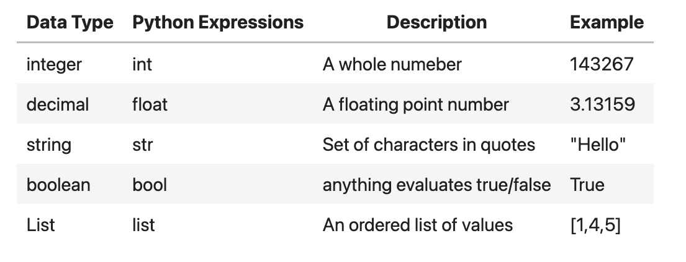
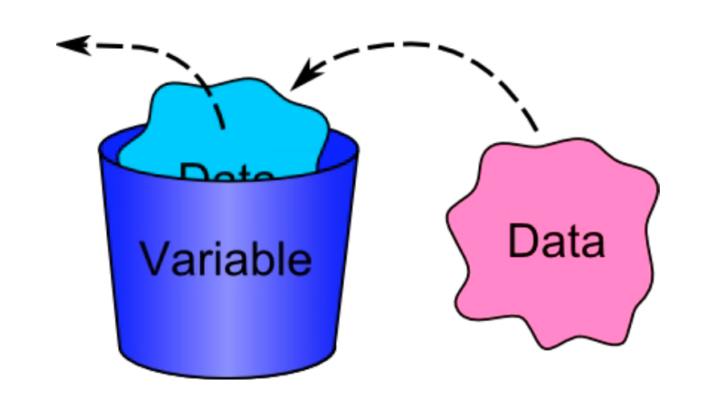
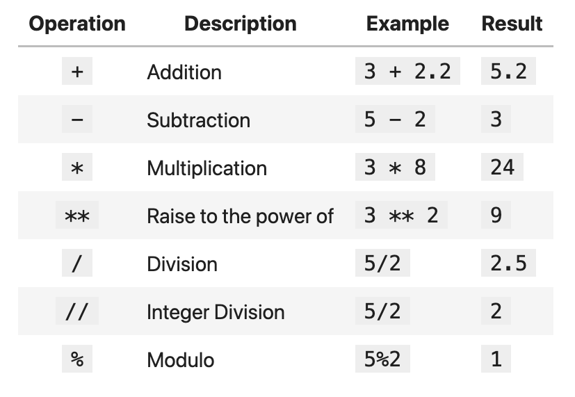
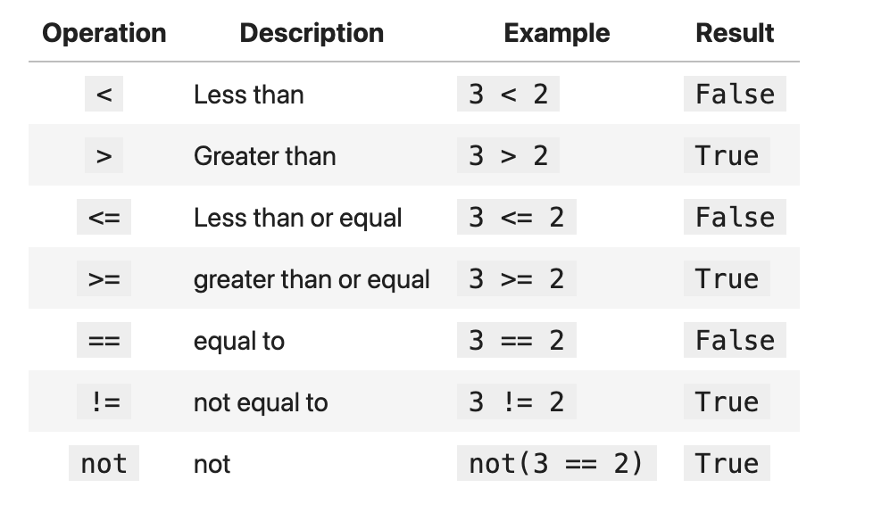

# Copyright Information


# Acknowledge of Country
I acknowledge the traditional custodians of the land on which I work and live,
and recognise their continuing connection to land, water and community. I pay
respect to elders past, present and emerging.


# Today

* Break a problems down into simple actions
* Actions carry out simple tasks
* A set of actions is called an algorithm
* Algorithms expressed as Pseudocode
* Coding is translating an algorithm to a program
* Six operations a computer can do

::: {.notes}
**Aim**
This slide introduces the agenda and key topics for the presentation on AI and machine learning.

**Context**
Following the opening slides on copyright and acknowledgement of country, this slide provides an overview of the presentation's contents. The subsequent slides delve into problem-solving methodologies and introduce fundamental programming concepts.
:::

# Problem Solving

“The biggest mistake I see new programmers make is focusing on learning syntax instead of learning how to solve problems\.”

— V\. Anton Spraul\, Think Like a Programmer: An Introduction to Creative Problem solving

::: {.notes}
**Aim**
The aim of this slide is to introduce the concept of problem solving in the context of AI and machine learning.

**Context**
This slide comes early in the presentation, following the introductory slides on copyright information and acknowledgement of country. It sets the stage for discussing problem solving methodologies and techniques in subsequent slides.

**Presenter Notes**
This slide is intentionally left blank to allow the presenter to engage the audience and invite their thoughts on problem solving. The presenter may ask the audience to share examples of problems they have faced in their work or studies related to AI and machine learning. This interaction helps to make the topic more relevant and relatable for the audience.

The lack of bullet points also serves as a visual cue for the presenter to pause and reflect on the importance of problem solving as a fundamental skill in AI and machine learning. It provides an opportunity to emphasise that the ability to break down complex problems, identify key components, and develop systematic approaches is essential for success in this field.

The presenter can use this slide to highlight that the upcoming slides will delve into specific problem solving methodologies and techniques that are commonly used in AI and machine learning. This sets the expectation for the audience and helps to create a logical flow for the presentation.
:::

# Problem Solving Methodology

- State the problem clearly
- Describe the input and output
- Work a simple example by hand
- Develop and algorithm
- Convert to Python (or some other languagE)
- Test solution with a variety of data

::: {.notes}
**Aim**
This slide aims to introduce a structured approach to problem-solving in the context of AI and machine learning.

**Context**
Having discussed the importance of problem-solving skills, this slide breaks down a step-by-step methodology that can be applied to tackle challenges in AI and machine learning. The subsequent slides will elaborate on some of these steps, such as stating the problem clearly and using pseudocode.

**State the problem clearly** Before attempting to solve a problem, it is crucial to have a clear understanding of what the problem is. This involves identifying the key issues, constraints, and desired outcomes. By stating the problem clearly, you can focus your efforts on finding the most appropriate solution.

**Describe the input and output** To develop an effective algorithm, you need to define the expected inputs and outputs. This includes specifying the data types, formats, and any constraints or assumptions. By clearly describing the input and output, you can ensure that your solution is compatible with the problem requirements.

**Work a simple example by hand** Before diving into complex algorithms, it is helpful to work through a simple example by hand. This allows you to break down the problem into smaller steps and gain a better understanding of the logic required. By manually solving a simple case, you can identify patterns and develop insights that will inform your algorithm design.

**Develop an algorithm** With a clear problem statement and an understanding of the inputs and outputs, you can now develop an algorithm to solve the problem. This involves outlining the step-by-step process for transforming the input into the desired output. The algorithm should be designed to handle various scenarios and edge cases efficiently.

**Convert to Python (or some other language)** Once you have developed an algorithm, the next step is to implement it in a programming language such as Python. This involves translating the algorithmic steps into code, taking into account the specific syntax and libraries of the chosen language. It is important to write clean, well-documented code that accurately reflects the algorithm.

**Test solution with a variety of data** After implementing the solution, it is crucial to test it with a diverse range of input data. This includes both typical cases and edge cases to ensure that the algorithm performs as expected. Testing helps identify any bugs, limitations, or areas for optimization. By thoroughly testing the solution, you can have confidence in its robustness and reliability.
:::

# State the Problem Clearly

“If you can’t explain something in simple terms\, you don’t understand it\.”

— Richard Feynman


::: {.notes}
**Aim**
The aim of this slide is to emphasise the importance of clearly defining the problem when problem solving.

**Context**
This slide follows on from an introduction to problem solving and the problem solving methodology. It precedes slides that discuss specific problem solving techniques like rubber duck debugging and pseudocode.
:::

# Rubber Duck


::: {.notes}
**Aim**
Introduce the concept of "rubber duck debugging" as a problem-solving technique in programming.

**Context**
This slide follows the "Problem Solving Methodology" and "State the Problem Clearly" slides, providing a specific technique for addressing programming issues. It precedes the "Psuedocode" and "Psuedocode Example" slides, which present another approach to problem-solving in programming.

**Bullet Point 1**
Rubber duck debugging is a technique where programmers explain their code, line by line, to an inanimate object, such as a rubber duck. This process helps them identify errors, inconsistencies, or areas for improvement in their code. By articulating the purpose and functionality of each line, programmers can often spot issues they might have overlooked during the coding process.

**Bullet Point 2**
The concept of rubber duck debugging is derived from a story in the book "The Pragmatic Programmer" by Andrew Hunt and David Thomas. In the book, a programmer carries around a rubber duck and explains his code to it, helping him solve problems more effectively. This anecdote has become a well-known reference in the programming community.

**Bullet Point 3**
Rubber duck debugging is a simple yet powerful technique that can be used by programmers of all skill levels. It encourages a systematic and thoughtful approach to problem-solving, as the act of explaining code step-by-step can help reveal gaps in logic or understanding. This technique can be particularly useful when dealing with complex or stubborn bugs.

**Bullet Point 4**
While the term "rubber duck debugging" specifically refers to the use of a rubber duck, the concept can be applied using any inanimate object or even a willing colleague. The key is to verbally explain the code in detail, as if teaching it to someone else. This process of externalization can help programmers better understand their own code and identify areas for improvement.
:::

# Psuedocode

- List the steps
- Use short phrases \(make it easier to convert\)
- No Syntax or rules
- Not a language  \(not compiled or executed\)
- Communication tool
- Logic of the solution
- Translate into a programming language

::: {.notes}
**Aim**
The purpose of this slide is to introduce pseudocode as a tool for outlining the logic and steps of a solution to a problem, without being tied to specific programming language syntax.

**Context**
This slide follows on from discussing problem-solving methodologies and precedes an example of pseudocode in action. It sits within the broader context of the presentation covering fundamental concepts in AI and machine learning, such as values, variables and operators.

**List the steps** Pseudocode involves listing out the sequential steps needed to solve a problem or implement an algorithm. By breaking down the solution into clear, ordered steps, it helps to clarify the logic and flow of the approach.

**Use short phrases (make it easier to convert)** When writing pseudocode, use concise, simple language rather than complete sentences. Short phrases make the pseudocode more readable and easier to convert into actual programming language code later on.

**No Syntax or rules** Pseudocode does not adhere to the strict syntax rules of programming languages. This allows the focus to remain on expressing the logic and sequence of the solution without getting bogged down in language specifics.

**Not a language (not compiled or executed)** Pseudocode is not an actual programming language that can be compiled or run. Its purpose is to communicate and plan the logic of a program in a human-readable way, not to be machine executable.

**Communication tool** One of the key roles of pseudocode is as a tool for communicating ideas between developers, team members and stakeholders. It provides a common language to discuss the logic and approach of a solution without requiring technical programming knowledge.

**Logic of the solution** Pseudocode captures the algorithmic thinking behind a solution - the logical steps, decisions, iterations, etc. It describes what needs to be done to solve the problem, rather than how to do it in a specific language.

**Translate into a programming language** Once the logic of a solution has been planned out in pseudocode, the next step is converting it into a chosen programming language. The pseudocode acts as a blueprint to guide the actual coding process.
:::

# Psuedocode Example

```text
Pick up dictionary
Open to middle of dictionary
Look at page
If word is on page
   Read definition
Else if word is earlier in book
   Open to middle of left half of book
   Go back to line 3
Else if word is later in book
   Open to middle of right half of book
   Go back to line 3
Else
   Quit
```

::: {.notes}
**Aim**
This slide aims to provide a concrete example of pseudocode to illustrate the concepts discussed in the previous slide.

**Context**
Following the introduction to pseudocode, this slide offers a practical demonstration of how pseudocode can be used to outline the logic and structure of a program. The example will help learners understand the application of the six basic operations and the use of variables, which will be covered in subsequent slides.
:::

# Only Six  Operations

- Receive Information
- Output Information
- Perform Arithmetic
- Assign a value to a variable
- Compare to variables
- Repeat a group of actions.

::: {.notes}
**Aim**
Introduce the six fundamental operations that computers can perform, which form the basis for all computational tasks.

**Context**
Having discussed problem-solving methodologies and pseudocode, this slide focuses on the core capabilities of computers. It sets the stage for the following slides, which delve into values, variables, and operators.

**Receive Information**
Computers can accept input from various sources, such as keyboards, mice, touchscreens, or sensors. This allows them to gather data and instructions necessary for processing. Input can be in the form of text, numbers, or even binary data.

**Output Information**
After processing data, computers can display results or send information to external devices. Common output methods include displaying text or graphics on a screen, printing documents, playing audio, or transmitting data over networks.

**Perform Arithmetic**
Computers excel at mathematical calculations. They can perform basic arithmetic operations like addition, subtraction, multiplication, and division with incredible speed and accuracy. These operations are fundamental to many computational tasks.

**Assign a value to a variable**
Variables are used to store and reference data in a program. Computers can assign specific values to variables, allowing for efficient data management and manipulation. This enables programs to keep track of changing data throughout execution.

**Compare to variables**
Computers can compare the values of two or more variables using relational operators. This allows for decision-making in programs, such as determining equality, greater than, or less than relationships between variables. Comparisons are crucial for controlling program flow and implementing conditional logic.

**Repeat a group of actions.**
Computers can execute a set of instructions repeatedly using loops. This allows for efficient processing of large amounts of data or performing iterative tasks. Loops enable computers to automate repetitive operations, saving time and effort compared to manual execution.
:::

# Computer can…

- Store Values
- Perform Operations

::: {.notes}
**Aim**
The aim of this slide is to introduce the fundamental capabilities of computers in storing data and executing instructions.

**Context**
Having discussed problem-solving methodologies and pseudocode, this slide transitions to the basic building blocks of computer programming. It lays the foundation for subsequent slides on values, variables, and operators.

**Store Values**
Computers have the ability to store and retrieve data in their memory. This data can be in various forms such as numbers, text, or images. The computer allocates a specific location in its memory to hold each piece of data, allowing it to be accessed and manipulated as needed. Storing values is a crucial aspect of computer programming, as it enables the preservation and utilisation of data throughout the execution of a program.

**Perform Operations**
In addition to storing data, computers can execute a set of instructions, known as operations or computations, on that data. These operations can be arithmetic (such as addition, subtraction, multiplication, or division), logical (comparisons and conditional statements), or manipulations of the stored values (like combining or splitting text). By performing these operations, computers can process and transform data, solve complex problems, and generate meaningful outputs based on the provided instructions and data.
:::

# What are values?

- Single Value
  - Integer (count)
  - Float (measurE)
  - Character
  - Boolean



::: {.notes}
**Aim**
The aim of this slide is to introduce the different types of values that can be used in programming.

**Context**
This slide follows on from the discussion of problem-solving methodology and pseudocode. It provides a foundation for understanding variables and operators, which will be covered in the subsequent slides.

**Single Value** A single value is the simplest type of data that can be stored in a program. It represents a single piece of information, such as a number or a character. Single values are the building blocks of more complex data structures.

**Integer (count)** An integer is a whole number that can be positive, negative, or zero. Integers are commonly used for counting and indexing. They are represented by a fixed number of bits, which determines the range of values they can store.

**Float (measure)** A float, short for floating-point number, is used to represent decimal numbers. Floats are useful for measuring and calculating values that require precision, such as distances or weights. They are stored using a mantissa and an exponent, allowing for a wide range of values.

**Character** A character is a single letter, digit, punctuation mark, or symbol. Characters are typically represented by a single byte of memory and are used for storing and manipulating text data. They can be combined to form strings, which are sequences of characters.

**Boolean** A boolean is a data type that can have only two possible values: true or false. Booleans are used for logical operations and decision-making in programs. They are essential for controlling the flow of execution based on certain conditions.
:::

# Variables

A  _variable_  is the name given to a part of the computers memory\, designed to store a particular data item\.



::: {.notes}
**Aim**
The aim of this slide is to introduce the concept of variables and their role in programming.

**Context**
This slide follows on from the discussion of values and precedes the explanation of variable names and operators. It forms part of the broader introduction to fundamental programming concepts.
:::

# Variable Names

* Rules
  * Only letters\, numbers\, and the underscore character \(\_\)
  * No spaces
  * No quotes
  * Can’t start with a number
  * Can't be a keyword import
* Conventions
  * variable names should be meaningful
  * separate words with underscores  \(snake\_case\)

::: {.notes}
**Aim**
This slide aims to provide guidelines for choosing appropriate variable names in programming.

**Context**
Having introduced the concept of variables in the previous slide, this slide delves into the specifics of naming variables effectively. The next slides will cover operators and relational operators, building on the foundation of variables and their names.

**Descriptive Names** 
Variable names should be descriptive and meaningful, clearly indicating the purpose or content of the variable. For example, instead of using a generic name like "x", choose a name like "age" or "student_count" that conveys the variable's role in the program. Descriptive names enhance code readability and make it easier for other developers (or yourself in the future) to understand the code's intent.

**Consistent Naming Conventions**
Adopt a consistent naming convention throughout your codebase. Common conventions include camelCase (e.g., firstName), PascalCase (e.g., ClassName), or snake_case (e.g., student_id). Stick to the chosen convention to maintain uniformity and improve code clarity. Consistency in naming helps avoid confusion and makes the code more predictable and easier to follow.

**Avoid Reserved Keywords**
When choosing variable names, avoid using reserved keywords specific to the programming language you are using. Reserved keywords have predefined meanings and cannot be used as variable names. Examples of reserved keywords in various languages include "if", "while", "for", "class", etc. Familiarize yourself with the reserved keywords of the language you are working with to prevent naming conflicts and syntax errors.

**Keep Names Concise**
While variable names should be descriptive, they should also be concise. Aim for a balance between clarity and brevity. Avoid excessively long names that can make the code harder to read and maintain. Use abbreviations or acronyms judiciously and only when they are widely understood within the context of your project or domain. Striking the right balance ensures that variable names are informative without being cumbersome.
:::

# Operators



::: {.notes}
**Aim**
Introduce various operators used in programming and explain their purpose.

**Context**
After discussing variables and values, the next logical step is to introduce operators. These allow us to perform calculations and comparisons using the variables and values. The following slide will go into more detail about relational operators specifically.
:::

# Relational Operators


::: {.notes}
**Aim**
The aim of this slide is to introduce relational operators and their role in programming.

**Context**
This slide follows on from the discussion of operators in general. It leads into the next slide which tests the audience's understanding of the concepts covered.
:::

# Can you

- Break a problems down into simple actions
- Actions carry out simple tasks
- A set of actions is called an algorithm
- Algorithms expressed as Pseudocode
- Coding is translating an algorithm to a program
- Six operations a computer can do

::: {.notes}
**Aim**
The aim of this slide is to introduce the concept of algorithms and how they are expressed in programming.

**Context**
Following on from discussing problem-solving methodologies and pseudocode, this slide explores the fundamental building blocks of algorithms and how they are translated into computer programs. It leads into the next topic of values, variables and operators.

**Break a problems down into simple actions**
To create an algorithm, you first need to break down a problem into a series of simple, clearly defined actions or steps. Each action should be a single, straightforward task that can be carried out without requiring further breakdown. This process of decomposition is crucial in designing effective algorithms.

**Actions carry out simple tasks**
Each action within an algorithm is responsible for carrying out a specific, simple task. These tasks are the basic building blocks of the algorithm and are typically very limited in scope. For example, an action might be to add two numbers together, compare two values, or store a piece of data.

**A set of actions is called an algorithm**
When you combine a series of actions together in a specific order to solve a problem or accomplish a task, you create an algorithm. An algorithm is essentially a step-by-step procedure or set of instructions that can be followed to achieve a desired outcome. Algorithms are used to solve a wide variety of problems in computer science and programming.

**Algorithms expressed as Pseudocode**
Pseudocode is a way of expressing algorithms using a simplified, informal language that is easy for humans to read and understand. It uses a combination of natural language and programming-like syntax to describe the steps of an algorithm. Pseudocode is not tied to any specific programming language and serves as a blueprint for the actual code.

**Coding is translating an algorithm to a program**
Once an algorithm has been designed and expressed in pseudocode, the next step is to translate it into an actual computer program using a programming language. This process, known as coding, involves writing instructions that the computer can execute using the specific syntax and rules of the chosen language. The programmer's goal is to accurately translate the algorithm into code that runs correctly and efficiently.

**Six operations a computer can do**
At their core, computers can only perform six fundamental operations: input, output, processing, branching, looping, and storing data. Every program, no matter how complex, is ultimately built upon these six basic operations. Understanding these operations and how they are combined to create algorithms is essential for effective programming.
:::

# Next time

- Making decisions
- Controlling the flow of a program

::: {.notes}
**Aim**
This slide aims to preview the key programming concepts that will be covered in the next lesson.

**Context**
After introducing fundamental concepts like problem-solving, pseudocode, variables, and operators, this slide serves as a glimpse into the upcoming topics. It bridges the gap between the basic building blocks and the more advanced programming concepts that enable students to create functional programs.

**Making decisions**
In the next lesson, we will explore how computers make decisions based on certain conditions using control structures such as if-else statements and switch-case statements. These concepts allow programmers to create programs that can respond differently based on user input or other variables, enabling more dynamic and interactive software.

**Controlling the flow of a program** 
We will also discuss how to control the flow of a program using loops, such as for loops and while loops. These structures allow programmers to repeat a block of code multiple times, either for a specified number of iterations or until a certain condition is met. By mastering these concepts, students will be able to create more efficient and powerful programs.
:::

