# Copyright Information


# Acknowledge of Country

I acknowledge the traditional custodians of the land on which I work and live,
and recognise their continuing connection to land, water and community. I pay
respect to elders past, present and emerging.


# Today

1. Summary
2. Introduction to PyInputPlus
2. Basic PyInputPlus Functions
3. Advanced PyInputPlus Features
4. Exception Handling in Python
5. Combining PyInputPlus and Exception Handling

::: {.notes}
**Aim**
Provide an overview of the topics that will be covered in today's presentation on AI and machine learning.

**Context**
This slide serves as an agenda for the presentation, following the Copyright Information and Acknowledgement of Country slides. It sets the stage for the subsequent slides, which will delve into specific concepts and examples related to AI and machine learning using Python.
:::

# Six Things
- Input
- Output
- Calculations (expressions)
- Store values (assignment)
- Make decisions (if-then, booblean)
- Repeate things (for, while, list comphresnsion)

::: {.notes}
**Aim**
The aim of this slide is to introduce the six fundamental elements of programming that form the foundation of any coding language.

**Context**
This slide serves as a bridge between the introductory slides and the more in-depth exploration of Python concepts. It sets the stage for the following slides, which delve into the specifics of Python programming, such as PyInputPlus, exception handling, and creating robust user input functions.

**Input** 
In programming, input refers to the data or information that is provided to a program for processing. This can include user input from the keyboard, data from files, or information from other sources. Input is essential for making programs interactive and dynamic, allowing them to respond to different scenarios and user needs.

**Output** 
Output is the result or information that a program produces after processing the input. This can be in the form of text displayed on the screen, data written to a file, or any other form of communication between the program and the user or other systems. Effective output is crucial for conveying the results of a program's computations and making them understandable to the user.

**Calculations (expressions)**
Calculations, or expressions, are the mathematical or logical operations performed on data within a program. These can include arithmetic operations like addition, subtraction, multiplication, and division, as well as more complex operations involving functions and variables. Expressions allow programs to manipulate and transform data to produce desired results.

**Store values (assignment)**
Storing values, or assignment, involves assigning a value to a variable for later use in the program. Variables act as containers for data, allowing programmers to reference and manipulate values throughout the code. Assignment is a fundamental concept in programming, as it enables the creation of reusable and modular code.

**Make decisions (if-then, boolean)**
Making decisions, or conditional statements, allow programs to execute different code blocks based on whether a specific condition is true or false. If-then statements and boolean expressions are used to evaluate conditions and determine the flow of the program. This enables programs to respond to different scenarios and make decisions based on input or computed values.

**Repeat things (for, while, list comprehension)**
Repeating things, or iteration, involves executing a block of code multiple times. This can be achieved using loops like for and while, which allow programs to iterate over a sequence of values or continue executing until a specific condition is met. List comprehension is a concise way to create lists based on existing lists or other iterable objects. Iteration is essential for automating repetitive tasks and processing large amounts of data efficiently.
:::

# Methodology
1. Understand the problem
2. Determine inputs/outputs
3. Work the problem by hand
4. Create the Algorithm
5. Convert to Python
6. Test with a variety of inputs

::: {.notes}
**Aim**
This slide provides an overview of the methodology used in the AI and machine learning project.

**Context**
The "Methodology" slide follows the "Six Things" slide and precedes the "Python Concepts" slide. It serves as a bridge between the high-level overview and the technical details of the project, providing a foundation for understanding the subsequent slides on Python programming and exception handling.
:::

# Python Concepts
- Values (Literals)
- Data Types (everything has a datatype)
  - str (string)
  - int (integer)
  - float (real number, decimal number)
  - list []
- Expressions
  - Mathematical operations  evaluates to value
  - Relational Operators  Boolean Expressions
  - Assignment. Store/save a value to a variable
  - if-else (selection)
  - Repetition (for, while) 
- Functions
  - builtins
  - import (other packages to extend python)
  - custom (create yourt own)

::: {.notes}
**Aim**
The aim of this slide is to provide an overview of key Python concepts that are essential for understanding and working with the Python programming language.

**Context**
This slide is part of a larger presentation on AI and machine learning, and it serves to lay the foundation for understanding Python, which is a commonly used language in these fields. The concepts covered in this slide will be built upon in subsequent slides, such as those discussing PyInputPlus and exception handling.

**Values (Literals)**
In Python, values or literals are the actual data that is processed by the program. These can be numbers, strings, or other data types. For example, `5`, `"hello"`, and `3.14` are all values or literals in Python.

**Data Types (everything has a datatype)**
Every value in Python has a specific data type, which determines the kind of data it represents and the operations that can be performed on it. Some common data types include integers, floating-point numbers, and strings. Python is a dynamically-typed language, meaning that you don't need to explicitly declare the data type of a variable; Python infers it based on the value assigned.

**str (string)**
A string is a sequence of characters enclosed in single quotes (`'...'`) or double quotes (`"..."`). Strings are used to represent text data in Python. For example, `"Hello, world!"` is a string.

**int (integer)**
An integer is a whole number, positive or negative, without any decimal points. For example, `42`, `-7`, and `0` are all integers in Python.

**float (real number, decimal number)**
A floating-point number, or float, is a number with a decimal point. Floats are used to represent real numbers in Python. For example, `3.14`, `-2.5`, and `1.0` are all floats.

**list []**
A list is an ordered, mutable collection of items enclosed in square brackets (`[...]`). Lists can contain elements of different data types and are commonly used to store and manipulate collections of related data. For example, `[1, 2, 3]` is a list of integers, and `["apple", "banana", "cherry"]` is a list of strings.

**Expressions**
An expression is a combination of values, variables, operators, and function calls that evaluates to a single value. For example, `2 + 3` is an expression that evaluates to the value `5`.

**Mathematical operations → evaluates to value**
Python supports various mathematical operations, such as addition (`+`), subtraction (`-`), multiplication (`*`), division (`/`), and more. These operations evaluate to a single value. For example, the expression `5 * 2` evaluates to the value `10`.

**Relational Operators → Boolean Expressions**
Relational operators are used to compare values and create Boolean expressions that evaluate to either `True` or `False`. Some common relational operators include equal to (`==`), not equal to (`!=`), greater than (`>`), and less than (`<`). For example, the expression `5 > 3` evaluates to `True`.

**Assignment. Store/save a value to a variable**
Assignment is the process of storing a value in a variable, which is a named location in the computer's memory. The assignment operator (`=`) is used to assign a value to a variable. For example, `x = 5` assigns the value `5` to the variable `x`.

**if-else (selection)**
The `if-else` statement is used for conditional execution of code blocks based on the truth value of a condition. If the condition is `True`, the code block under the `if` statement is executed; otherwise, the code block under the `else` statement (if present) is executed.

**Repetition (for, while)**
Python provides two main ways to perform repetition or iteration: the `for` loop and the `while` loop. A `for` loop is used to iterate over a sequence (such as a list or string) or other iterable objects, executing a block of code for each item. A `while` loop repeatedly executes a block of code as long as a given condition is `True`.

**Functions**
Functions are reusable blocks of code that perform a specific task. Python has two types of functions: built-in functions and user-defined functions. Functions can take input parameters and return output values.

**builtins**
Python comes with a set
:::

# Environment

- Google Colab (Python Notebook) 
  - Code Cells
  - Text Cells (Markdown)
  - Interactively run cells
  - Output in notebook
- Github
  - Cloud storage
  - version control
- Workflow
  - Edit/Prototype in notebook
  - Frequently save to GitHub

::: {.notes}
**Aim**
The purpose of this slide is to introduce the development environment and tools used for AI and machine learning, focusing on Google Colab and GitHub.

**Context**
This slide is part of the "Environment" section of the presentation, which comes after an introduction to Python concepts. It provides an overview of the tools and workflow used in the course, before diving into specific topics like PyInputPlus and exception handling.

**Google Colab (Python Notebook)** Google Colab is a cloud-based Python notebook environment that allows you to write, execute, and share Python code. It provides a convenient platform for developing and running machine learning models without the need for local setup.

**Code Cells** In Google Colab, you can create code cells to write and execute Python code. These cells allow you to break down your code into manageable chunks and run them independently, making it easier to test and debug your code.

**Text Cells (Markdown)** Text cells in Google Colab support Markdown, a lightweight markup language for formatting text. You can use Markdown to add headings, lists, links, and other formatting elements to your notebook, making it more readable and organised.

**Interactively run cells** One of the key features of Google Colab is the ability to run cells interactively. You can execute code cells individually or in groups, allowing you to test and refine your code incrementally. This interactive nature of Colab makes it an ideal environment for experimentation and learning.

**Output in notebook** When you run code cells in Google Colab, the output is displayed directly below the cell. This includes any text, images, or visualisations generated by your code. Having the output in the notebook makes it easy to analyse results and share your work with others.

**Github** GitHub is a web-based platform for version control and collaboration. It allows you to store and manage your code repositories, track changes, and collaborate with others on projects. In this course, you will use GitHub to store and share your Colab notebooks.

**Cloud storage** By using Google Colab and GitHub, you can store your code and notebooks in the cloud. This means you can access your work from any device with an internet connection, without the need for local storage or setup. Cloud storage also provides a backup of your work, ensuring that you don't lose your progress.

**version control** GitHub provides powerful version control features, allowing you to track changes to your code over time. You can create branches to experiment with new features, merge changes back into the main branch, and revert to previous versions if needed. Version control is essential for managing complex projects and collaborating with others.

**Workflow** The typical workflow in this course involves editing and prototyping your code in Google Colab notebooks, then frequently saving your work to GitHub. This allows you to iterate quickly, test new ideas, and maintain a record of your progress.

**Edit/Prototype in notebook** Google Colab provides a fast and easy way to edit and prototype your code. You can quickly make changes, run cells, and see the results in real-time. This makes it an ideal environment for experimenting with new concepts and refining your machine learning models.

**Frequently save to GitHub** To ensure that your work is backed up and accessible from anywhere, it's important to frequently save your Colab notebooks to GitHub. This also allows you to share your work with others, collaborate on projects, and maintain a record of your progress throughout the course.
:::

# Introduction to PyInputPlus

- What is PyInputPlus?
  - A Python module for easy, robust input validation
- Why use PyInputPlus?
  - Simplifies input validation (for beginners)
  - Reduces boilerplate code
  - Handles common input scenarios out-of-the-box

::: {.notes}
**Aim**
The aim of this slide is to introduce PyInputPlus, a Python module that simplifies input validation and reduces boilerplate code.

**Context**
This slide is part of a larger presentation on AI and machine learning with Python. It follows an introduction to key Python concepts and precedes more detailed slides on PyInputPlus functions and features.

**What is PyInputPlus?**
PyInputPlus is a Python module that provides a set of functions for accepting and validating user input. It extends Python's built-in input() function, adding features like type conversion, range checking, and regular expression matching.

**A Python module for easy, robust input validation**
PyInputPlus makes it easy to validate user input without writing extensive custom validation code. It can check that input is of the correct type (e.g., integer, float, string), falls within a specified range, matches a regular expression pattern, and more.

**Why use PyInputPlus?**
There are several reasons to use PyInputPlus in your Python projects. It can save development time, reduce the amount of code you need to write, and help ensure that your programs can handle a variety of input scenarios gracefully.

**Simplifies input validation (for beginners)**
For beginning Python programmers, validating user input can be challenging. PyInputPlus provides a simple, intuitive interface for common input validation tasks, making it easier for beginners to write programs that accept user input safely.

**Reduces boilerplate code**
Without PyInputPlus, validating user input often requires writing similar code across multiple parts of a program. PyInputPlus allows you to replace this boilerplate code with concise function calls, reducing code duplication and making your programs more readable.

**Handles common input scenarios out-of-the-box**
PyInputPlus comes with built-in support for many common input scenarios, such as accepting integers, floats, and strings; enforcing minimum and maximum values; and validating against regular expressions. This means you can handle a wide variety of input cases without writing custom validation logic.
:::

# PyInputPlus

- Installing PyInputPlus
  ```
  pip install pyinputplus
  ```
- Importing PyInputPlus
  ```python
  import pyinputplus as pyip
  ```

::: {.notes}
**Aim**
This slide aims to introduce the PyInputPlus module and provide instructions on installing and importing it for use in Python projects.

**Context**
The PyInputPlus slide follows the "Introduction to PyInputPlus" slide and precedes slides that delve into the basic functions and advanced features of the module. It serves as a starting point for users to set up PyInputPlus before exploring its capabilities in the subsequent slides.

**Installing PyInputPlus**
To begin using PyInputPlus, users must first install the module. This can be done by running the command `pip install pyinputplus` in the terminal or command prompt. It is important to ensure that Python and pip are properly installed and configured on the system before attempting to install PyInputPlus. Once the installation is complete, the module will be available for use in Python projects.

**Importing PyInputPlus**
After successfully installing PyInputPlus, users can import the module into their Python scripts or interactive sessions. To do this, they should include the statement `import pyinputplus as pyip` at the beginning of their code. This statement allows users to refer to the PyInputPlus module using the alias `pyip` throughout their code, making it more convenient to access its functions and features.
:::

# Basic PyInputPlus Functions

- Numeric input validation
  - `inputNum()`: For any number (integer or float)
  - `inputInt()`: For integers only
  - `inputFloat()`: For floating-point numbers
- String input validation
  - `inputStr()`: For string input with optional constraints
  - `inputChoice()`: For selecting from a list of choices
- Yes/No and Boolean inputs
  - `inputYesNo()`: Returns 'yes' or 'no'
  - `inputBool()`: Returns True or False
- Date and time inputs
  - `inputDate()`: For date input
  - `inputTime()`: For time input

::: {.notes}
**Aim**
This slide introduces the basic functions provided by the PyInputPlus library for validating and handling various types of user input in Python programs.

**Context**
Having covered fundamental Python concepts and the PyInputPlus library, this slide dives into the specific functions available for handling numeric, string, boolean, and date/time inputs. The following slides will expand on more advanced features and exception handling with PyInputPlus.

**Numeric input validation** PyInputPlus offers functions for validating numeric input from users. The `inputNum()` function accepts any number, either an integer or a floating-point value. For more specific validation, `inputInt()` ensures the input is strictly an integer, while `inputFloat()` validates input as a floating-point number.

**String input validation** The `inputStr()` function is used for validating string input from users. It allows for optional constraints to be specified, such as a minimum and maximum length or a regular expression pattern that the input must match. The `inputChoice()` function is useful when you want the user to select from a predefined list of choices.

**Yes/No and Boolean inputs** PyInputPlus provides functions for handling yes/no and boolean input. The `inputYesNo()` function prompts the user for input and returns either 'yes' or 'no'. The `inputBool()` function is similar but returns the boolean values True or False based on the user's input.

**Date and time inputs** For validating date and time input, PyInputPlus offers the `inputDate()` and `inputTime()` functions, respectively. These functions ensure that the user enters a valid date or time string and can automatically convert the input to a `datetime` object for further processing.
:::

# Advanced PyInputPlus Features

- Creating custom prompt messages
  ```python
  temp = pyip.inputFloat("Enter temperature in Celsius: ")
  ```
- Handling default values
  ```python
  city = pyip.inputStr("Enter city name (default: Perth): ", default="Perth")
  ```
- Using timeouts and retry limits
  ```python
  user_input = pyip.inputStr(timeout=10, limit=3)
  ```

::: {.notes}
**Aim**
This slide aims to introduce advanced features of PyInputPlus that allow for customisation and more robust user input handling.

**Context**
Having covered the basic PyInputPlus functions in the previous slide, this slide builds on that foundation to explore more advanced capabilities. The following slides will then focus on exception handling, which is important when working with user input.

**Creating custom prompt messages** PyInputPlus allows you to specify custom prompt messages for each input function. This enables you to provide clearer instructions or context to the user about the expected input. By using the `prompt` parameter, you can supply a string that will be displayed before the user enters their input.

**Handling default values** In cases where you want to provide a default value that is used if the user doesn't enter anything, PyInputPlus has you covered. The `default` parameter allows you to specify a value that will be returned if the user simply presses Enter without typing anything. This can streamline user input and reduce friction in your program's flow.

**Using timeouts and retry limits** PyInputPlus offers functionality to prevent your program from getting stuck waiting for user input indefinitely. The `timeout` parameter lets you set a maximum number of seconds to wait for input before raising a `TimeoutException`. Similarly, the `limit` parameter allows you to specify a maximum number of tries a user has to enter valid input before a `RetryLimitException` is raised. These features help make your program more resilient and responsive.
:::

# Exception Handling

- What are exceptions?
  - Runtime errors that disrupt normal program flow
- Why exceptions still occur with PyInputPlus
  - Network issues, file I/O errors, etc.

::: {.notes}
**Aim**
This slide aims to introduce the concept of exceptions in Python programming and explain why they can still occur when using the PyInputPlus module.

**Context**
The "Exception Handling" slide follows the "Advanced PyInputPlus Features" slide and precedes examples of specific exception types. It provides a foundation for understanding exceptions before demonstrating how to handle them in the context of PyInputPlus and Python programming in general.

**What are exceptions?**
In Python, exceptions are events that occur during program execution, disrupting the normal flow of instructions. These events are typically triggered when the program encounters an error or an unexpected situation that it cannot resolve on its own. Exceptions can be caused by various factors, such as invalid user input, attempting to access a non-existent file, or dividing a number by zero. When an exception occurs, the program halts execution and raises an exception object, which can be caught and handled by the program to prevent a complete crash.

**Runtime errors that disrupt normal program flow**
Exceptions are a type of runtime error, meaning they occur while the program is running, as opposed to syntax errors, which are detected by the Python interpreter before the program starts executing. When an exception is raised, it disrupts the normal flow of the program, and if not handled properly, it can lead to the termination of the program. This disruption allows the program to handle the error gracefully, provide meaningful feedback to the user, and potentially recover from the error state, depending on the nature of the exception and the implemented exception handling mechanism.

**Why exceptions still occur with PyInputPlus**
Although PyInputPlus is a powerful module that simplifies user input validation and handling, it does not eliminate the possibility of exceptions occurring in a program. PyInputPlus focuses on validating user input and ensuring that the input meets specified criteria, such as data type, value range, or regular expression patterns. However, exceptions can still arise from factors beyond the scope of user input validation, such as network connectivity issues when attempting to retrieve data from a remote source, file input/output (I/O) errors when reading from or writing to files, or system-related errors like insufficient memory or permissions.

**Network issues, file I/O errors, etc.**
Network issues can lead to exceptions when a program using PyInputPlus attempts to retrieve data from a remote server or API. These issues may include network connectivity problems, timeouts, or server-side errors. File I/O errors can occur when a program tries to read from or write to a file using PyInputPlus functions, and the file is not found, the program lacks sufficient permissions to access the file, or the file is corrupted. Other exceptions may arise from system-related issues, such as running out of memory or attempting to perform an operation without the necessary permissions. In these cases, PyInputPlus alone cannot prevent the exceptions, and the program must implement proper exception handling techniques to manage these situations gracefully.
:::

#  Exception Example: InvalidSyntax
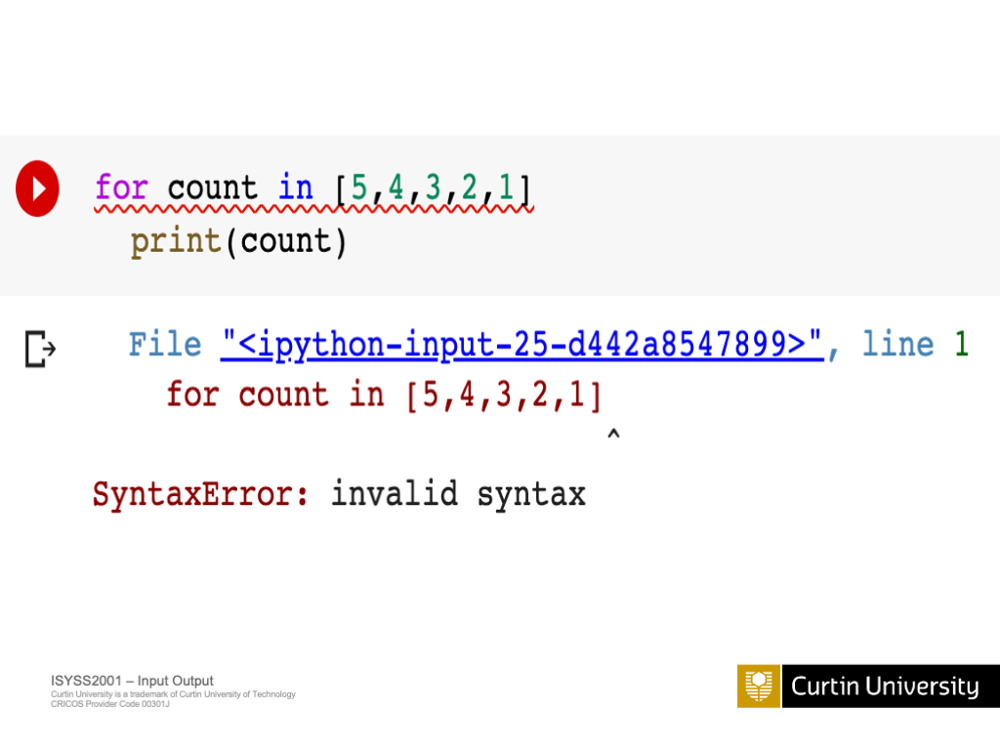

::: {.notes}
**Aim**
This slide aims to demonstrate an example of an InvalidSyntax exception in Python.

**Context**
This slide is part of the "Exception Handling" section of the presentation, which follows the introduction to Python concepts and the PyInputPlus module. It precedes slides on other common exception types, such as DivisionByZero and FileNotFound, and leads into the discussion of try-except blocks and handling specific exceptions.
:::

#  Exception Example: InvalidSyntax
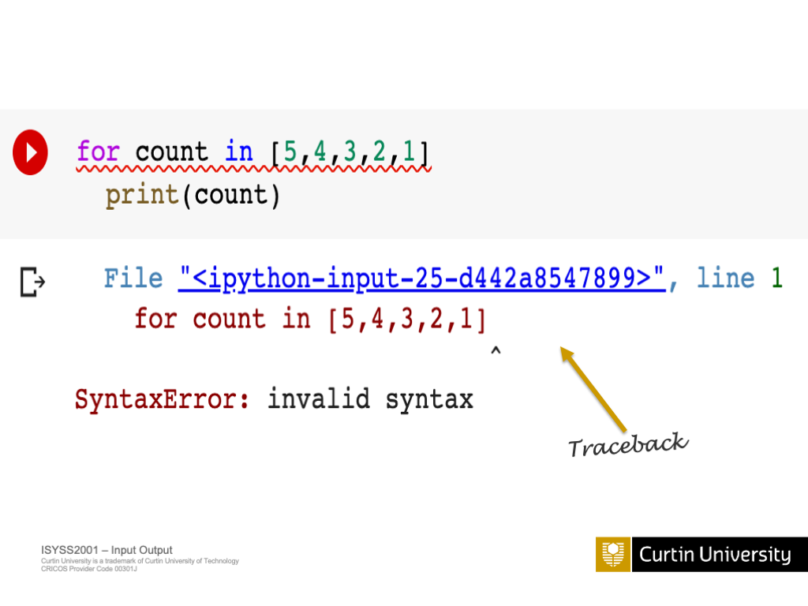

::: {.notes}
**Aim**
The aim of this slide is to provide an example of an InvalidSyntax exception and demonstrate how it can occur in Python code.

**Context**
This slide is part of a broader section on exception handling in Python. It follows an introduction to exception handling concepts and precedes slides showcasing other common exception types, such as DivisionByZero and FileNotFound. The slide serves to illustrate a specific, real-world scenario where an InvalidSyntax exception may be encountered.
:::

#  Exception Example: InvalidSyntax
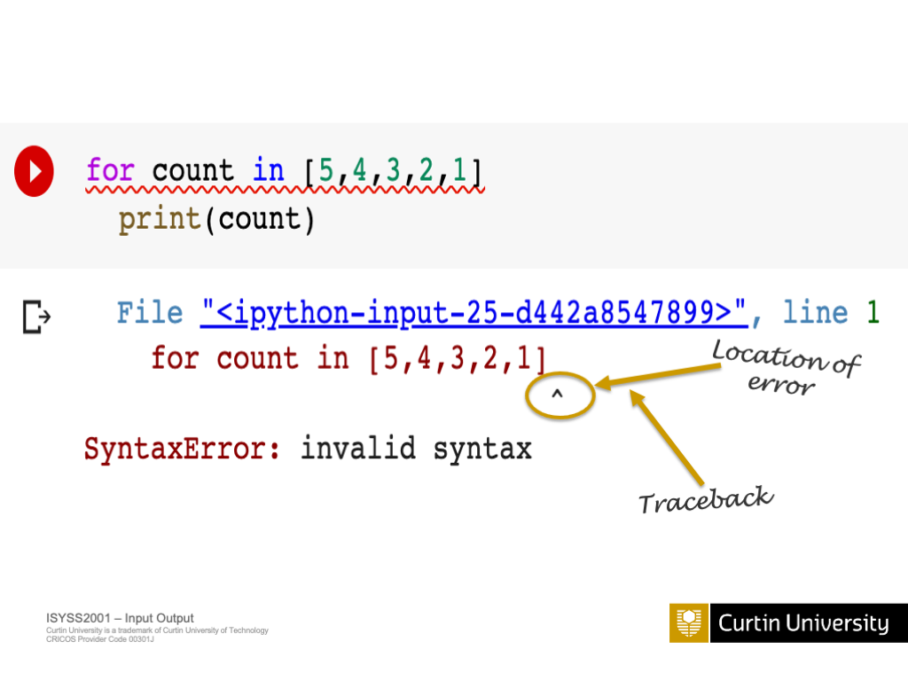

::: {.notes}
**Aim**
This slide examines a specific exception, InvalidSyntax, to demonstrate how Python handles syntax errors during code execution.

**Context**
This slide is part of the "Exception Handling" section of the presentation, which follows the introduction to Python concepts and the PyInputPlus library. It precedes slides on other exception examples, such as DivisionByZero and FileNotFound, and leads into the discussion of try-except blocks and handling specific exceptions.
:::

#  Exception Example: InvalidSyntax
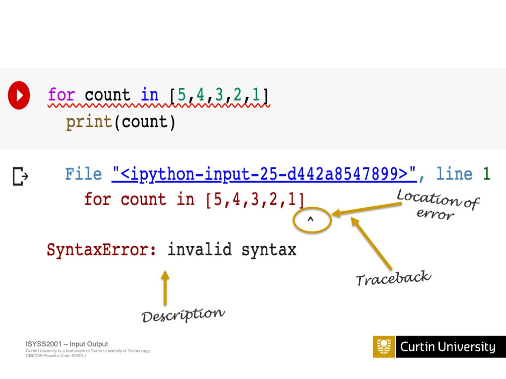

::: {.notes}
**Aim**
The aim of this slide is to demonstrate an example of an InvalidSyntax exception in Python.

**Context**
This slide is part of a series of slides that cover exception handling in Python. It follows a slide that introduces the concept of exceptions and precedes slides that cover other common types of exceptions.
:::

#  Exception Example: InvalidSyntax
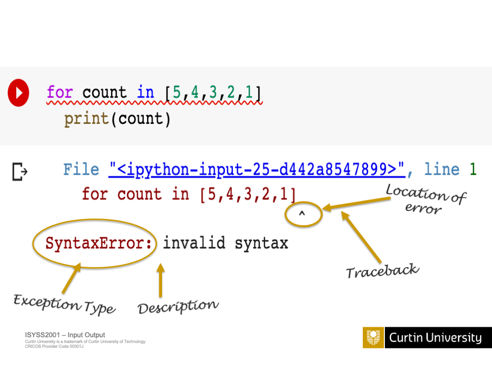

::: {.notes}
**Aim**
The aim of this slide is to demonstrate an example of an InvalidSyntax exception in Python.

**Context**
This slide is part of the "Exception Handling" section of the presentation, following an introduction to exceptions and preceding examples of other specific exception types, such as DivisionByZero and FileNotFound. The slide is intended to provide a concrete example to help the audience understand the concept of InvalidSyntax exceptions.
:::

#  Exception Example: DivisionByZero
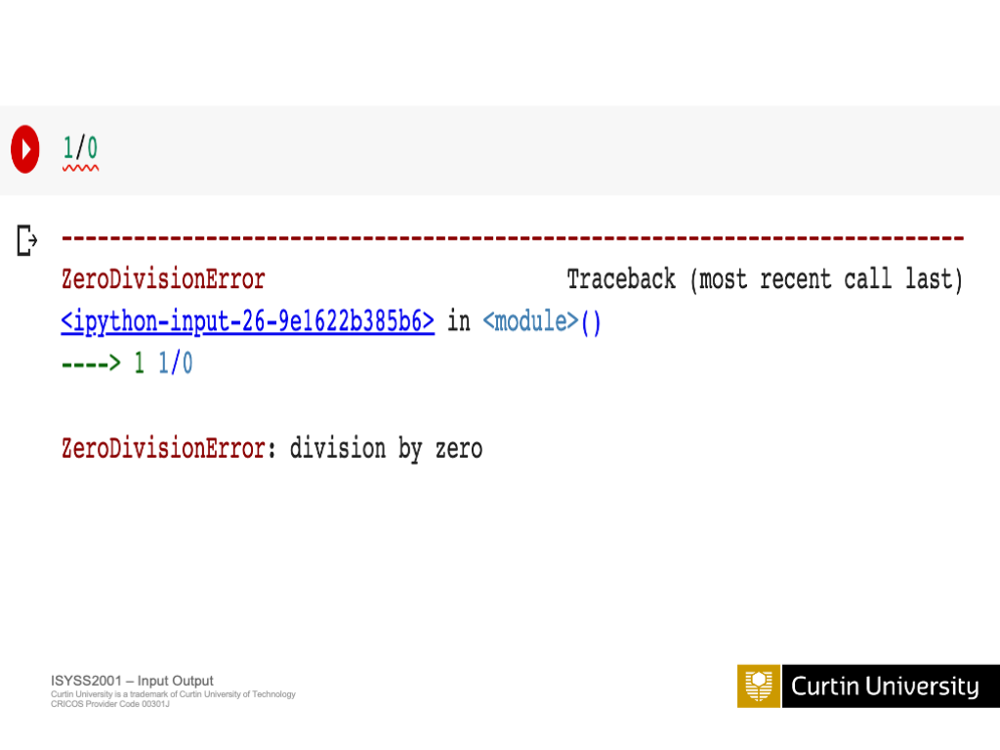

::: {.notes}
**Aim**
This slide aims to demonstrate an example of the DivisionByZero exception in Python and how it can be handled.

**Context**
This slide is part of the Exception Handling section of the presentation, following the slide on the InvalidSyntax exception example. It provides another common exception scenario and sets the stage for discussing try-except blocks and handling specific exceptions in the subsequent slides.
:::

#  Exception Example: DivisionByZero
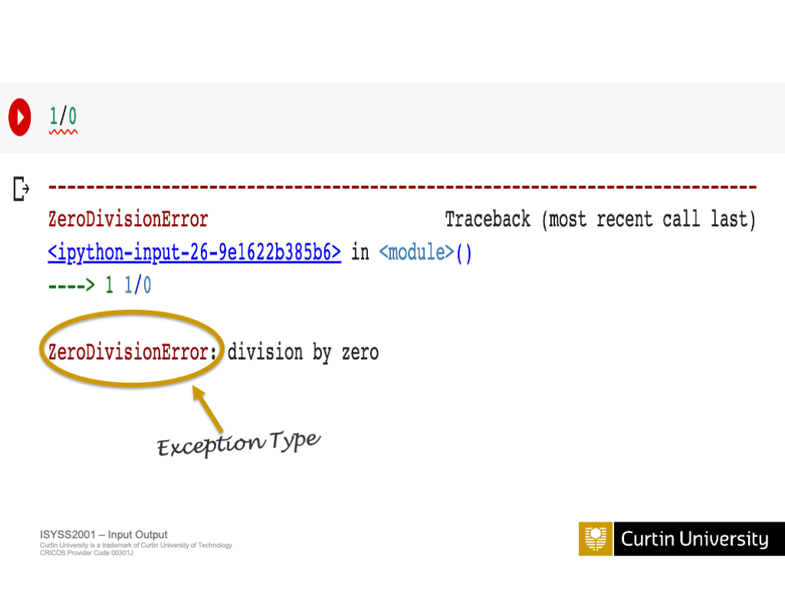

::: {.notes}
**Aim**
The purpose of this slide is to provide an example of a DivisionByZero exception and explain how it can occur in Python code.

**Context**
This slide is part of the Exception Handling section of the presentation, which covers various types of exceptions and how to handle them in Python. It follows the slides on InvalidSyntax exceptions and precedes the slides on FileNotFound exceptions.
:::

#  Exception Example: FileNotFound
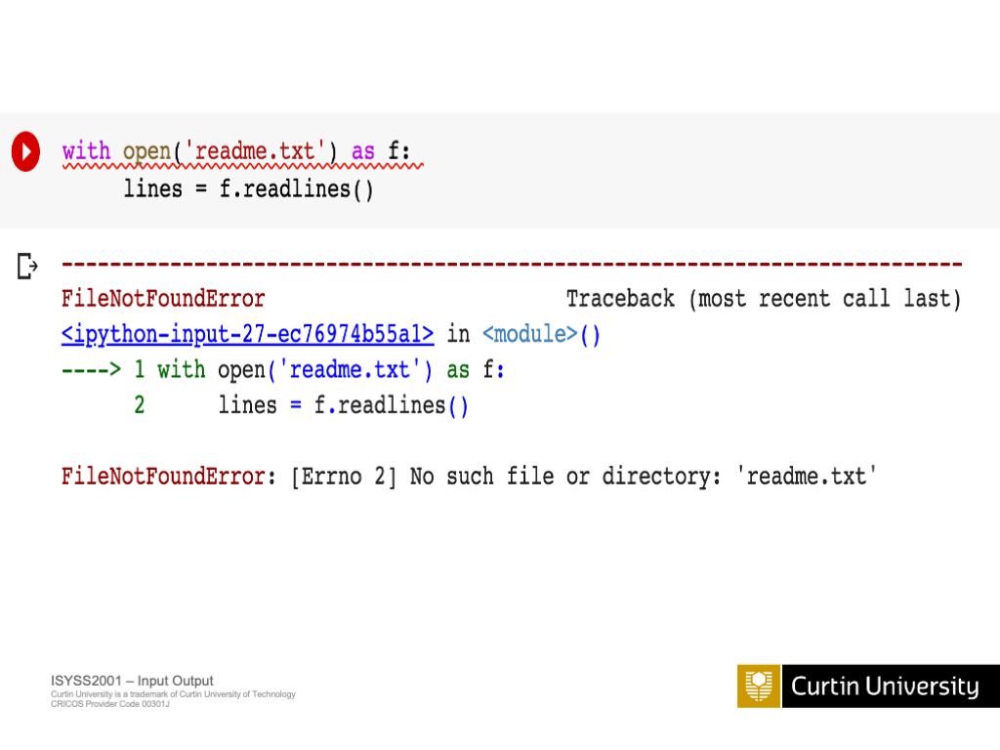

::: {.notes}
**Aim**
The aim of this slide is to provide an example of a FileNotFound exception and demonstrate how it can occur in Python code.

**Context**
This slide is part of the "Exception Handling" section of the presentation, which covers various types of exceptions that can occur in Python programs. It follows the slides on InvalidSyntax and DivisionByZero exceptions and precedes the slides on try-except blocks and handling specific exceptions.
:::

#  Exception Example: FileNotFound
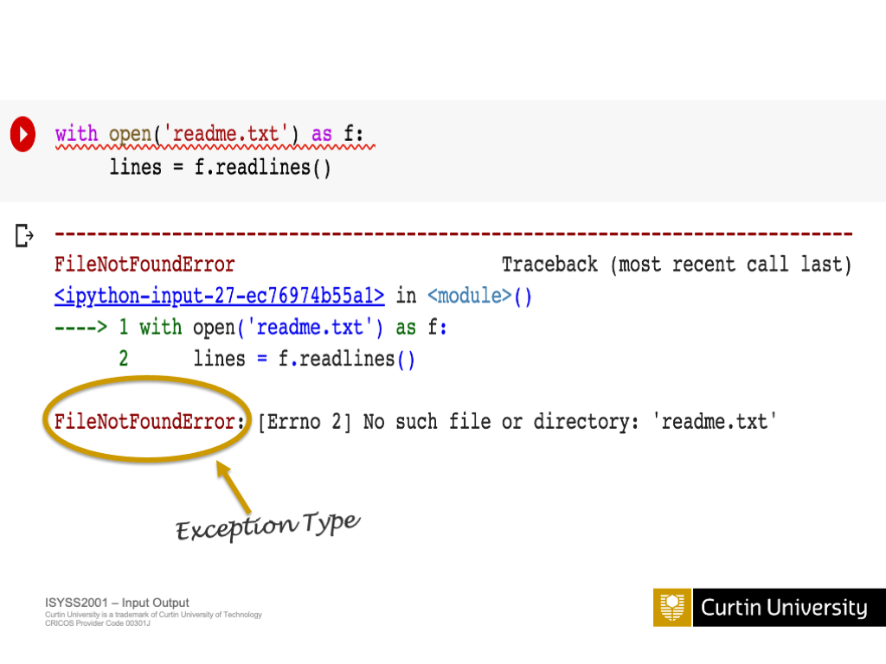

::: {.notes}
**Aim**
The aim of this slide is to demonstrate how to handle a FileNotFound exception in Python.

**Context**
This slide is part of a series on exception handling in Python, following examples of InvalidSyntax and DivisionByZero exceptions. It leads into slides on try-except blocks and handling specific exceptions.

**[Bullet Point 1]**

**[Bullet Point 2]**
:::

# Try-except blocks
  ```python
  try:
      # Code that might raise an exception
  except ExceptionType:
      # Handle the exception
  ```

::: {.notes}
**Aim**
This slide aims to introduce try-except blocks as a way to handle exceptions and errors in Python code.

**Context**
The presentation has covered various Python concepts, including an introduction to PyInputPlus and its functions. The previous slides have also discussed exception handling and provided examples of different types of exceptions. This slide on try-except blocks builds upon the concept of exception handling and demonstrates how to use these blocks to handle exceptions gracefully.

**Exception Handling**
Try-except blocks are a fundamental aspect of exception handling in Python. They allow developers to anticipate and handle potential errors or exceptions that may occur during the execution of their code. By using try-except blocks, developers can prevent their programs from crashing abruptly when encountering exceptions, and instead, they can provide alternative paths or error messages to handle the situation gracefully.

**Handling specific exceptions**
Within try-except blocks, developers can specify the types of exceptions they want to handle. This allows for targeted exception handling, where specific actions can be taken based on the type of exception encountered. For example, if a program expects a FileNotFoundError, it can be caught and handled differently than a ZeroDivisionError. By handling specific exceptions, developers can provide more meaningful error messages and take appropriate actions to recover from the error.

**Raising exceptions**
In addition to handling exceptions, Python allows developers to raise exceptions manually using the raise keyword. This is useful when developers want to indicate that a specific condition or error has occurred in their code. By raising exceptions, developers can control the flow of their program and provide custom error messages to help with debugging and error handling.

**Handling PyInputPlus-specific exceptions**
PyInputPlus is a library that provides functions for getting user input with additional validation features. It has its own set of exceptions that can be raised when user input does not meet the specified criteria. When using PyInputPlus functions within a try-except block, developers can catch and handle these specific exceptions, such as TimeoutException or RetryLimitException, to provide appropriate feedback to the user and handle the input validation process effectively.

**Creating robust user input functions**
By combining the concepts of exception handling and PyInputPlus, developers can create robust user input functions that handle various scenarios gracefully. These functions can use try-except blocks to catch and handle exceptions that may occur during user input, such as invalid input types or timeouts. By incorporating exception handling, developers can ensure that their user input functions are resilient and provide a better user experience by handling errors and providing informative feedback to the user.
:::

#  Exception Handling
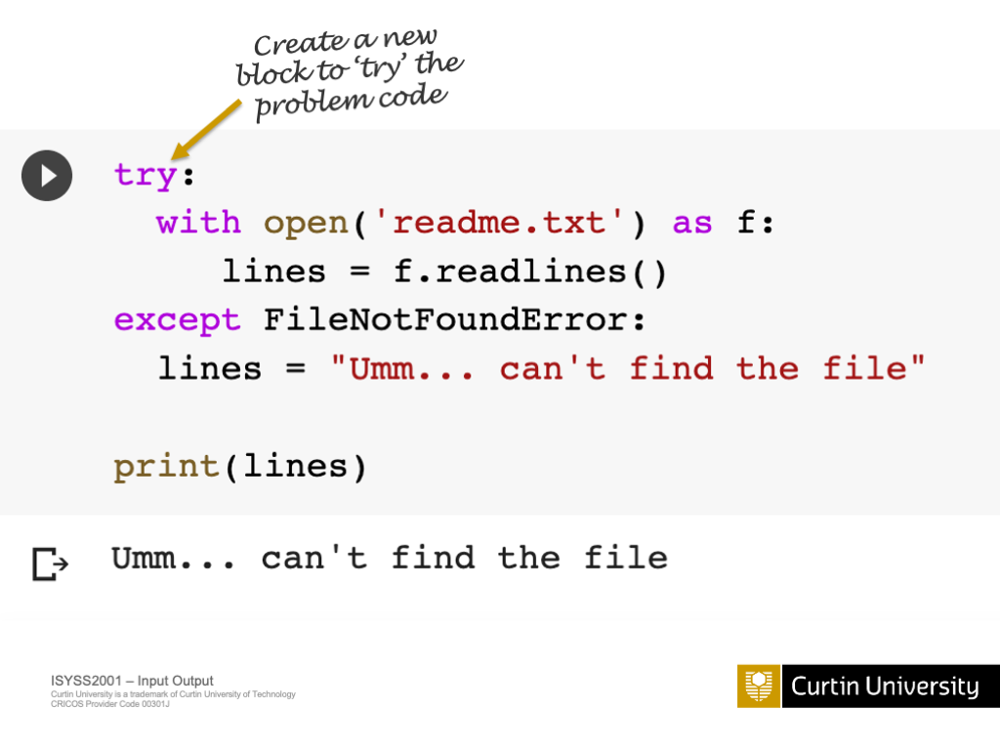

::: {.notes}
**Aim**
The aim of this slide is to introduce exception handling in Python and explain how it is used to handle errors and unexpected situations in code.

**Context**
This slide follows on from the previous slides that introduced basic Python concepts and the PyInputPlus module. It is part of a series of slides that cover various aspects of Python programming, leading up to more advanced topics in AI and machine learning.

**Exceptions**
Python uses special objects called exceptions to manage errors that arise during program execution. When an error occurs, Python creates an exception object that contains information about the error, such as its type and the location in the code where it occurred. The process of creating this object and dealing with the error is called raising an exception.

**Handling Exceptions**
If an exception is not handled by the program, it will terminate abruptly and display an error message. To prevent this, you can write code to handle exceptions gracefully. This is done using the try and except statements in Python. The try block contains the code that might raise an exception, and the except block specifies what to do if an exception occurs.

**Types of Exceptions**
Python has many built-in exceptions that cover a wide range of error conditions, such as ZeroDivisionError, FileNotFoundError, and TypeError. You can also define your own custom exceptions by creating a new exception class. It's important to choose the appropriate exception type to handle specific errors in your code.

**Best Practices**
When handling exceptions, it's best to be as specific as possible. Catch only the exceptions that you can handle meaningfully. Avoid using bare except clauses that catch all exceptions, as this can mask potential bugs in your code. If you need to perform cleanup actions after an exception occurs, use the finally block, which runs regardless of whether an exception was raised or not.
:::

#  Exception Handling
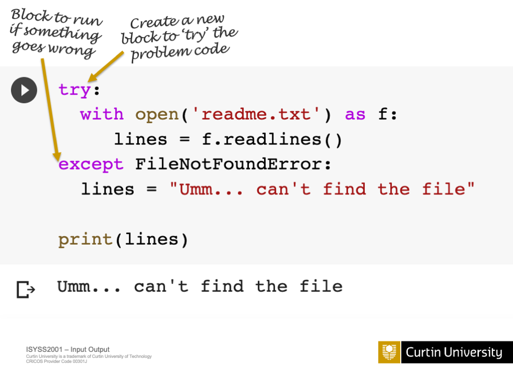

::: {.notes}
**Aim**
This slide aims to introduce the concept of exception handling in Python and its importance in creating robust programs.

**Context**
The "Exception Handling" slide is part of the Python Concepts section, following the introduction to PyInputPlus. It sets the foundation for the subsequent slides that provide specific examples of different exceptions and how to handle them using try-except blocks.

**[No bullet points provided]**
Exception handling is a critical aspect of programming in Python. When writing code, it's common to encounter errors or exceptions that can cause the program to crash or behave unexpectedly. Exception handling allows developers to anticipate and handle these errors gracefully, preventing the program from abruptly terminating and providing meaningful feedback to the user. By using try-except blocks, developers can catch and handle specific exceptions, allowing the program to continue running even if an error occurs. This slide will introduce the basic concepts of exception handling and set the stage for more detailed examples in the following slides.
:::

#  Exception Handling
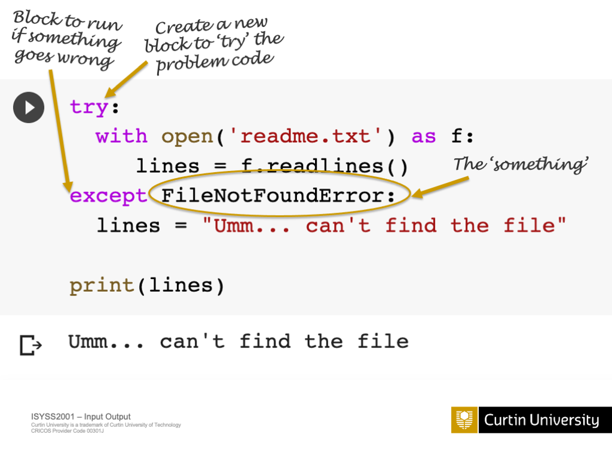

::: {.notes}
**Aim**
This slide aims to introduce the concept of exception handling in Python and highlight its importance in creating robust programs.

**Context**
The "Exception Handling" slide follows the introduction of basic Python concepts and the PyInputPlus module. It serves as a foundation for the upcoming slides, which delve into specific exception examples and how to handle them effectively.

**[Bullet Point 1]** Exceptions are events that occur during program execution, disrupting the normal flow of instructions. They typically indicate errors or unexpected situations, such as dividing by zero, accessing a non-existent file, or using an undefined variable. When an exception is raised, it can cause the program to terminate abruptly if not handled properly.

**[Bullet Point 2]** Exception handling is a mechanism in Python that allows you to catch and respond to exceptions gracefully. By using try-except blocks, you can anticipate potential exceptions and provide alternative paths of execution. This helps prevent program crashes and enables you to handle errors in a controlled manner, providing meaningful feedback to users or taking corrective actions.

**[Bullet Point 3]** Proper exception handling is crucial for building reliable and user-friendly programs. It allows you to handle expected and unexpected errors, maintain program stability, and provide informative error messages to users. By anticipating and handling exceptions, you can improve the overall quality and robustness of your code, making it more resilient to various scenarios.

**[Bullet Point 4]** Python provides a rich set of built-in exception classes that cover a wide range of error scenarios. Some common exceptions include ValueError for invalid input, FileNotFoundError for missing files, and ZeroDivisionError for division by zero. You can also define your own custom exception classes to handle specific error cases in your program.

**[Bullet Point 5]** When an exception occurs, Python raises an exception object that contains information about the error, such as the exception type and a traceback. By catching and examining these exception objects, you can gain insights into the nature of the error and take appropriate actions based on the specific exception type. This allows for fine-grained control over error handling.
:::

# Handling specific exceptions
  ```python
  try:
      temperature = float(input("Enter temperature: "))
  except ValueError:
      print("Invalid input. Please enter a number.")
  ```

::: {.notes}
**Aim**
The aim of this slide is to explain how to handle specific exceptions in Python programs.

**Context**
This slide builds on the previous slides which introduced exception handling and provided examples of different types of exceptions. It leads into the next slide on raising exceptions.

**[Bullet Point 1]** Python allows you to catch and handle specific exceptions using multiple except clauses. Each except clause can specify a different exception to catch. This allows you to take different actions depending on the exception that occurred. For example, you might want to print one error message if a FileNotFoundError occurs and another for a ValueError.

**[Bullet Point 2]** When using multiple except clauses, more specific exceptions must be listed before more general ones. For instance, IOError is more general than FileNotFoundError, so the FileNotFoundError except clause must come first in your code. Otherwise, the FileNotFoundError would be caught by the more general IOError except clause, and the specific handling code would never be executed.

**[Bullet Point 3]** You can also combine an except clause with an else clause. Code in the else block will only execute if no exceptions were raised by the code in the try block. This can be useful for code that should run only if no exceptions occurred.

**[Bullet Point 4]** Finally, a try statement can have a finally clause. The code in a finally clause is guaranteed to execute, no matter what exceptions occur. This is useful for clean-up code that should always run, like closing files or database connections. The finally clause will execute after any except clauses (if an exception occurred) or after the else clause (if no exception occurred).
:::

# Raising exceptions
  ```python
  if temperature > 100:
      raise ValueError("Temperature too high!")
  ```

::: {.notes}
**Aim**
The purpose of this slide is to introduce the concept of raising exceptions in Python and explain when it is appropriate to do so.

**Context**
This slide follows on from the previous slides about exception handling, which covered the basics of try-except blocks and handling specific exceptions. It leads into the next slide about handling PyInputPlus-specific exceptions.
:::

# Handling PyInputPlus-specific exceptions
  ```python
  from pyinputplus import RetryLimitException, TimeoutException

  try:
      response = pyip.inputStr(limit=3, timeout=10)
  except RetryLimitException:
      print("You've reached the maximum number of attempts.")
  except TimeoutException:
      print("Input timed out.")
  ```

::: {.notes}
**Aim**
The aim of this slide is to introduce techniques for handling exceptions specific to the PyInputPlus module.

**Context**
This slide follows on from the general exception handling content and focuses on the specifics of PyInputPlus. It precedes a slide on creating robust user input functions, which will likely build upon the concepts covered here.
:::

# Creating robust user input functions
  ```python
  def get_weather_input():
      try:
          city = pyip.inputStr("Enter city name: ")
          temp = pyip.inputFloat("Enter temperature in Celsius: ")
          return city, temp
      except Exception as e:
          print(f"An error occurred: {e}")
          return None, None
  ```

::: {.notes}
**Aim**
The aim of this slide is to provide an overview of how to create user input functions that are robust and can handle various types of input effectively.

**Context**
This slide builds upon the concepts introduced in the previous slides on PyInputPlus and exception handling. It aims to combine these concepts to demonstrate how to create user input functions that are reliable and can handle a wide range of input scenarios.
:::

# Today

1. Summary
2. Introduction to PyInputPlus
2. Basic PyInputPlus Functions
3. Advanced PyInputPlus Features
4. Exception Handling in Python
5. Combining PyInputPlus and Exception Handling

::: {.notes}
**Aim**
To provide an overview of the topics that will be covered in today's presentation on AI and machine learning.

**Context**
This slide serves as an introduction to the presentation, following the Copyright Information and Acknowledgement of Country slides. It sets the stage for the subsequent slides, which will delve into specific aspects of AI and machine learning, such as methodology, Python concepts, and exception handling.
:::

