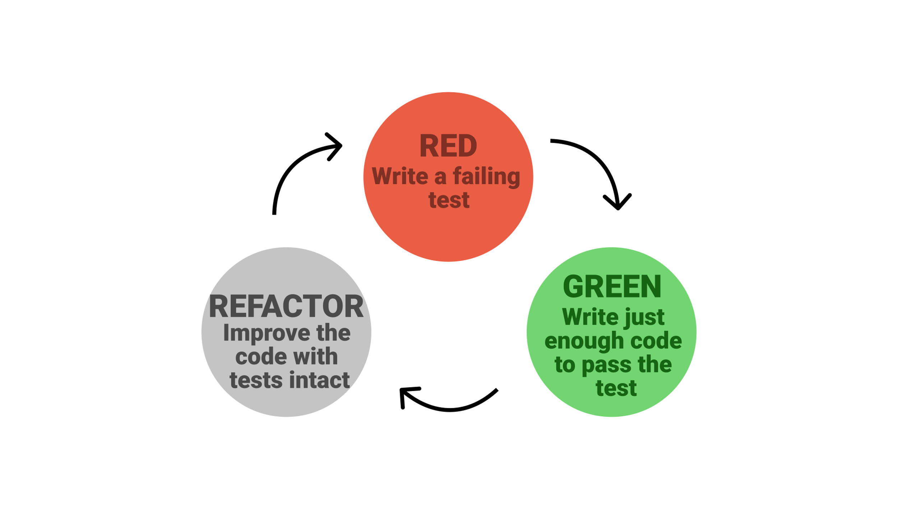

# Testing

ISYS2001\, School of Marketing and Management

I acknowledge the traditional custodians of the land on which I work and live\, and recognise their continuing connection to land\, water and community\. I pay respect to elders past\, present and emerging\.

# Today

Understand the difference between testing and debugging

Describe one approach of debugging

State why we test

List common testing strategies

# Problem Solving Methodology

State the problem clearly

Describe the input and output

Work a simple example by hand

Develop and algorithm \(and convert to Python\)

__Test solution with a variety of data__

Feedback Loop\(s\)

"I'm not a great programmer\, I'm just a good programmer with great habits"

Kent Beck

# Great Habits

Comments

Docstrings

Use/Create functions

Use/Create modules

Make small frequent commits

_A _  _software bug _  _is an error\, flaw or fault in computer software that causes it to produce an incorrect or unexpected result\, or to behave in unintended ways\._  _ _

Wikipedia   https://en\.wikipedia\.org/wiki/Software\_bug

_Debugging_  _ is the process to correct the bugs found during testing\._

# Types of Errors

Syntax Errors

Run\-Time Errors

Logic Error

# Debugging

* Step/Trace through code
  * __print\(\)__
  * logging\(\)
* Inspect Objects
  * __type\(\)__
  * inspect module
* Python debugger – pdb
  * __breakpoint\(\)__
  * traceback and other methods not enough

# Debugging Strategies

* Apply Trail and Error
* Compare to similar code
* Copy and paste for working code
* Ask for help \(peer\, forum\, google\)
* Use IDE
  * Syntax Highlighting
  * Auto completion
  * Linting

_Program _  _testing_  _ can be used to show the presence of bugs\, but never to show their absence\! _ Dijkstra \(1970\)

# Why Test

Reliable

Reproducible

Shareable

_Testing leads to failure\, and failure leads to understanding\. _

Burt Rutan

# What to test?

---

Requirements
Design
Code/Implementation
Documentation

# You already doing tests!

Validate input

Try variety of inputs \(data\)

We check output meet requirements

_We are provide more structure to the process_

# Types of Test

Unit – test an individual isolated component

Integration – test multiple units work together

End\-to\-End – act as user\, test entire stack

Acceptance Test – verify user store works as expected

---

Unit  Test an individual, isolated component

Integration  Test that multiple units work together OR "tests that confirm our code works against code we don't own" (like external APIs, databases, caches, etc)

End-to-End  Tests that act as a user actually using the application; tests the entire stack from top-to-bottom

Acceptance Domain-driven tests that verify a user story (also comparable to a use case, customer test, command/query, feature, or vertical slice) works as expected.

# Test Driven Development

A discipline where you grow software in small increments \(steps\) where you write the test before the implementation\.

# Approach Notebooks

* Write python script to test notebook
  * Package: testbook
* Write test and code in one notebook
  * Packages:  __assert\(\)\, __  __doctest__ \, unittest\, nose2 etc\.\.
* ‘Testing Notebook’ and import notebook\(s\)
  * Packages:  __assert\(\)\, __  __doctest__ \, unittest\, nose2 etc\.\.

---

Write test script to import notebook 
Write test and code in one notebook
Add ‘noise’
Run notebook, always run tests
Refactor notebook into modules, independently test modules

# Testing Everything

* Build up a suite of Tests
* Run all test with one cell/notebook/script
* Regression testing
* Test Table
  * Sane test\, then edge cases

# Can you…

Understand the difference between testing and debugging

Describe one approach of debugging

State why we test

List common testing strategies

